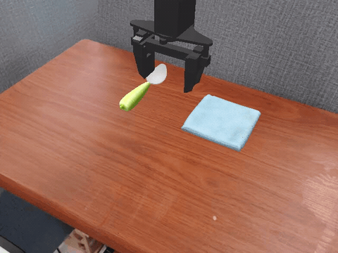

<!-- markdownlint-disable MD001 MD041 -->
<p align="center">
  
</p>

<p align="center">
  <em>YuePi0 deployed in SimplerEnv — WidowX "put spoon on towel"</em>
</p>

<h3 align="center">
A from-scratch, study-driven re-implementation of π0 — the Physical Intelligence VLA model
</h3>

🚧 YuePi0 is a personal reproduction project. The goal is **understanding**, not benchmarks — every module is rebuilt by hand from the [π0](https://www.physicalintelligence.company/blog/pi0) paper.

---

## About

YuePi0 (月Pi0) is a hand-written re-implementation of [π0](https://www.physicalintelligence.company/blog/pi0) — Physical Intelligence's flow-matching Vision-Language-Action model. The project follows a deliberate "rebuild-from-fundamentals" pedagogy: each subsystem (RoPE, GQA, KV-Cache, SigLip, Gemma, Mixture-of-Transformers, Joint Attention, Action Expert, Flow Matching) is built in isolation, tested with `pytest`, and `allclose`-verified against the reference HuggingFace / `open-pi-zero` implementation.

The full model is now **parameter-for-parameter compatible** with `open-pi-zero` (938 tensors, identical up to naming): an `open-pi-zero` checkpoint can be remapped and loaded directly, and the complete forward pass has been **numerically verified equivalent** via a two-process parity harness (max diff ~1e-8). The focus is now shifting from reproduction to deployment in simulation (SimplerEnv / WidowX).


## What's Implemented

**Backbone & attention primitives**

- RMSNorm and rotary positional embeddings (RoPE)
- Grouped-Query Attention with KV-Cache
- SigLip / ViT image encoder (PaliGemma vision tower)
- Gemma decoder layers (full numerical parity with HF)

**π0-specific composition**

- VLA preprocessor (multi-modal prompt + image tiling + action chunk packing)
- Mixture-of-Transformers (MoT) scaffold — VLM expert + proprio expert + action expert
- Joint attention dispatcher across experts (`getattr`-based layer routing)
- Per-expert RoPE / KV-Cache wiring
- Block-wise causal mask (VLM causal · proprio/action bidirectional within block)
- Action expert head: TimeEncoder (sinusoidal) + ActionEncoder + ActionDecoder
- Flow-matching training loss with (1−σ_min) conditional probability path
- Euler-integrator inference loop (image → proprio → action chunk)
- adaLN / adaLN-Zero adaptive normalization for the action expert (selectable via `action_expert_adaptive_mode`)

**Verification & loading**

- Numerical parity (`allclose`) against `open-pi-zero` for the full forward pass (two-process harness, max diff ~1e-8)
- Remap-and-load of pretrained `open-pi-zero` checkpoints into YuePi0

**Roadmap (in progress)**

- SimplerEnv / WidowX simulation deployment (`scripts/deploy_simpler.py` + env adapter)
- LeRobot / Bridge dataset training loop (VLM frozen, bf16 action expert)
- KV-cache enablement during multi-step Euler inference

See the up-to-date checklist below.

## Reproduction Progress

- [x] VLAPreProcessor
- [x] RoPE + RMSNorm
- [x] GQA + KV-Cache
- [x] ViT / SigLip
- [x] Gemma decoder
- [x] Mixture + JointModel scaffold
- [x] Action Expert (Time / Action / Proprio encoders + decoder)
- [x] Flow-Matching loss & sampler (σ_min schedule + Euler integrator)
- [x] End-to-end forward / inference (`PiZero.forward` + `PiZero.infer_action`)
- [x] adaLN / adaLN-Zero adaptive mode for action expert
- [x] Numerical parity vs `open-pi-zero` (full forward, diff ~1e-8)
- [x] Load remapped `open-pi-zero` checkpoint into YuePi0
- [ ] SimplerEnv / WidowX deployment loop
- [ ] Training loop on the Bridge dataset

## Getting Started

YuePi0 is pinned to **Python 3.10** and managed with [`uv`](https://docs.astral.sh/uv/).

```bash
git clone https://github.com/yukki3421/yuepi0.git
cd yuepi0

# Create env and install (editable, src-layout)
uv venv --python 3.10
source .venv/bin/activate
uv pip install -e .
```

Run the test suite to confirm every reproduced module matches the reference:

```bash
pytest tests/ -v
```

Per-module spot checks (each mirrors the `src/` layout):

```bash
pytest tests/model/paligemma/test_vit.py        # SigLip vision tower
pytest tests/model/paligemma/test_gemma.py      # Gemma decoder
pytest tests/model/paligemma/test_gemma_allclose.py  # numerical parity vs HF
pytest tests/model/vla/test_mixture.py          # MoT dispatcher
pytest tests/model/vla/test_joint_model.py      # joint attention across experts
pytest tests/model/vla/test_pizero.py           # end-to-end forward / inference / adaptive modes
```

## Repository Layout

```
src/model/
├── kvcache.py                  # simple per-layer KV cache
├── load_pretrained.py          # remap + load open-pi-zero checkpoints
├── paligemma/                  # vision-language backbone
│   ├── vit.py                  # SigLip ViT
│   ├── modules.py              # RMSNorm, RoPE, GQA, MLP
│   └── gemma.py                # decoder layer + full Gemma model
└── vla/                        # π0-specific composition
    ├── processing.py           # VLA preprocessor
    ├── mixture.py              # Mixture-of-Transformers expert wrapper
    ├── joint_model.py          # cross-expert joint attention
    └── yuepi0.py               # top-level model

src/agent/                      # training + deployment
│   ├── train.py                # Bridge training entry (VLM frozen, bf16)
│   └── env_adapter/            # SimplerEnv / WidowX adapters
src/data/                       # Bridge / fake dataset loaders
src/utils/geometry.py           # rotation / pose math for deployment

scripts/                        # parity harness, inspection, deploy
docs/                           # 中文学习笔记 (one per module)
tests/                          # mirrors src/ layout
config/yuepi0.yaml              # the single canonical model config
```

## Design Notes

The `docs/` directory carries Chinese-language study notes written alongside each module — they explain *why* the code looks the way it does, not just what it does:

**Primitives & backbone**

- [`rope_notes.md`](docs/rope_notes.md), [`rmsnorm_notes.md`](docs/rmsnorm_notes.md)
- [`gqa_notes.md`](docs/gqa_notes.md), [`kv_cache_notes.md`](docs/kv_cache_notes.md)
- [`vit_siglip_notes.md`](docs/vit_siglip_notes.md), [`paligemma_embedder_notes.md`](docs/paligemma_embedder_notes.md), [`gemma_notes.md`](docs/gemma_notes.md)

**π0 composition**

- [`processing_notes.md`](docs/processing_notes.md)
- [`mixture_notes.md`](docs/mixture_notes.md), [`joint_model_notes.md`](docs/joint_model_notes.md), [`dispatcher_notes.md`](docs/dispatcher_notes.md)
- [`flow_matching_and_sinusoidal_notes.md`](docs/flow_matching_and_sinusoidal_notes.md), [`pizero_inference_and_adaln_notes.md`](docs/pizero_inference_and_adaln_notes.md)

**Weights, parity & training**

- [`paligemma_weight_loading_notes.md`](docs/paligemma_weight_loading_notes.md), [`parity_test_notes.md`](docs/parity_test_notes.md)
- [`bridge_dataset_notes.md`](docs/bridge_dataset_notes.md), [`phase1_paligemma_bf16_training_notes.md`](docs/phase1_paligemma_bf16_training_notes.md)

## Acknowledgements

YuePi0 stands on the shoulders of:

- [Physical Intelligence](https://www.physicalintelligence.company/) — original π0 paper and weights
- [`allenzren/open-pi-zero`](https://github.com/allenzren/open-pi-zero) — the reference open-source PyTorch port that this repo is benchmarked against
- [`google/paligemma`](https://huggingface.co/google/paligemma-3b-pt-224) — the VLM backbone
- [`huggingface/transformers`](https://github.com/huggingface/transformers) — for `allclose` ground truth


## Contact

This is a one-person study project. For questions, open an issue on [GitHub](https://github.com/yukki3421/yuepi0/issues).
